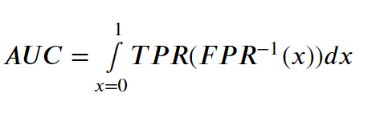

# A Machine Learning Project To Predict Blight Compliance

### A Binary Classifier Optimized for maximum Area Under Receiver Operating Characteristic Curve (AU-ROC Curve):
>  From Data Cleaning to Model Validation, Classifying whether a blight ticket will be paid in time or not, Trained 3 different Classifier on a Highly imbalanced Data provided by Detroit Open Data Portal with around 160000 Tickets.
## About The Data :

#### All The data for this project has been gathered through the Detroit Open Data Portal.

- *[Detroit Open Data Portal (Blight Violation)](https://data.detroitmi.gov/datasets/blight-violations)*

#### Description and More About Data Fields can found Here
 - [Descripton and Data Fields](https://github.com/ITrustNumbers/A_Classification_Model_To_Predict_Blight_Compliance/tree/master/Orignal_DataSet)
 
## Data Cleaning : ([Data Cleaning & Feature Engineering Notebook](https://github.com/ITrustNumbers/A_Classification_Model_To_Predict_Blight_Compliance/blob/master/Data%20Cleaning%20and%20Feature%20Engineering.ipynb))

1. **There are not a lot of null values in the data sets therefore, I Simply Dropped the rows with missing data and dropped *'violation_zip_code'* , *'non_us_str_zip_code'* , *'grafitti status'* Data Field as it was more than 60% missing, And i Also Dropped *'payement_date'* , *'collection_status'* Data Field to Avoid Data Leakage.**

2. **Then, I Combined the lat-lon.csv and addresses.csv Data Set to the train.csv to Map each *ticket_id* to corresponding *Latitude & Longitude*.** 

3. **Cleaned up Some of the Text Based Error in the Data Set and Some Dissimilarities were Handeled**
     > - E.x : Some Data Fields were Filled with *'Deter'* & *'Determi'* instead of *'Determination'*

## Feature Engineering : ([Data Cleaning & Feature Engineering Notebook](https://github.com/ITrustNumbers/A_Classification_Model_To_Predict_Blight_Compliance/blob/master/Data%20Cleaning%20and%20Feature%20Engineering.ipynb))

1. **Use Several Data Fields To Extract Model Ready Information :** 
    > 'Disposition' ----> 'Responsible_by' & 'Fine_Waived'   'Violator_description' ----> 'Len_Description' & 'Count_Violation'   'VIolator_name' ----> 'Type of violator'   'Ticket_Issued_date' ----> 'Month_BIn' & 'Ticket_TIme'
2. **Categorical Data Was Mapped for EDA**
 

    
## Exploratory Data Analysis : ([EDA & Feature Selection Notebook](https://github.com/ITrustNumbers/A_Classification_Model_To_Predict_Blight_Compliance/blob/master/Exploratory%20Data%20Analysis%20%26%20Feature%20Selection.ipynb))

### 1. Categorical Feature Distribution :
 

 
 

### 2. Categorical Feature Distribution  Over Compliance :
 

 

### 3. Co-Relation Visualization :
 

## Feature Selection : ([EDA & Feature Selection Notebook](https://github.com/ITrustNumbers/A_Classification_Model_To_Predict_Blight_Compliance/blob/master/Exploratory%20Data%20Analysis%20%26%20Feature%20Selection.ipynb))

> Two Methods were used for Feature selection Namely, Univariate Selection (Chi-Square Test) & Based on Feature Importance from a Simple Extra Tree Classifier 
 

### 1. Univariate Selection (Chi-Square Statistical Test) Score :
 

 
 

### 2. Feature Importance from a Simple Extra Tree Classifier  :
 

 
 

## Evaluation Metric Selection : ([Model Building Notebook](https://github.com/ITrustNumbers/A_Classification_Model_To_Predict_Blight_Compliance/blob/master/Model%20Building.ipynb))

#### Confusion Matrix for a Binary Classifier :

### 1. Recall ( The True Positive Rate ):
 
# 

- The True Positive divided by the sum of the False Negative and the True Positives.
- TPR describes the proportion of the actual postive samples that were correctly classified as positive, thus we want this value to approach 1.
 

### 2. Specificity ( The False Positive Rate ):
 
# 

- The False positives divided by the sum of the False Positive and the True Negatives.
- FNR describes the error of the Positive cases, thus we want this value to approach 0.
 

### 3. Receiver Operating Characteristics (ROC) is defined as:

- A comparison of the True Positive Rate and the False Positive Rate.

# 

- The goal is to have a ROC close to 1, as this suggests the model is getting a balanced split.
- The ROC can help guide where the best threshold split might be.
 

### 4. The Area Under the ROC Curve ( AUC ):
<ul>
<li>ie, the integral of the \(ROC(x)\epsilon D,s.t. D=0\le x\le 1\)</li></ul></li>

 

 
 

- This provides and aggregated measure of preformance across all thresholds.
- A general idea as to the overall potential accuracy of a model.
 

### Finally AU-ROC Was Chossen as Evaluation Matrix
 

## Model Building and HyperParameter Tuning : ([Model Building Notebook](https://github.com/ITrustNumbers/A_Classification_Model_To_Predict_Blight_Compliance/blob/master/Model%20Building.ipynb))

####  This DataSet is Highly Unbalanced thus, I will use 'A Dummy Classifiers' as a baseline for Performance and Evaluation namely:

1. Dummy Classifier (Stratergy = 'Most_Frequent')
2. Dummy Classifier (Stratergy = 'Unifrom')

####  For The Final Model Building as the Data is very Sparse and Feature Don't Relate with each other that much, I will Fit and Compare 4 Different Models namely:

1. KNN Classifier
2. Logistic Regression
3. Decision Tree

### Final Tuned Tree Visualization :
 

 

### Comparison of AU-ROC Curve Score for all the Trained and Tunned Models
 

 

### Finally The Logistic Regression Classifier was Chosen, As, it is Linear Therefore gives Prediction Faster and it gained the highest AU-ROC Score on the train set
 

## Model Validation : ([Model Validation Notebook](https://github.com/ITrustNumbers/A_Classification_Model_To_Predict_Blight_Compliance/blob/master/Model%20Validation.ipynb))
> ### The validation Data-Set was used to validate the Final Model, It Was Made Sure That The Validation set was never before seen by the Model during its Training Phase You Can See More On:  [In This Notebook](https://github.com/ITrustNumbers/A_Classification_Model_To_Predict_Blight_Compliance/blob/master/Transforming%20Validation%20Data%20to%20Match%20Training%20Data.ipynb) 
 

 

## Conclusion :
### The Final Logistic Regression Model With Parameters :
> #### C = 100 , Class_Weights = {0 : 0.3 , 1 : 0.7} , max_iter =1000 , penalty = 'l2' , Solver = 'lbfgs' , Dual = False , tol = 0.0001 
### Gained The Traget AU-ROC Curve Score of >0.8 i.e 0.84 with an Accuracy of 93% on the Validation Data
